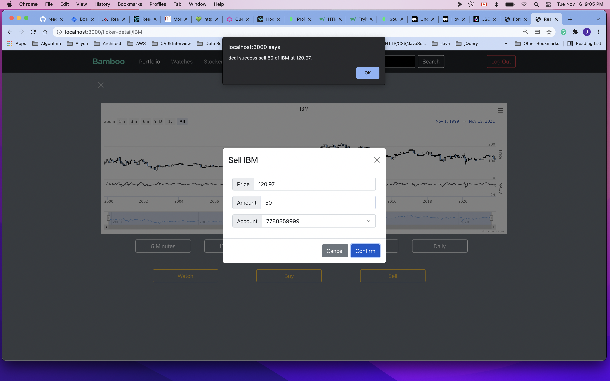

# bamboo (fc-final-project)

## 1. Installation and Start the App

### 1.1. clone the repo

	git@github.com:JeffTimesX/bamboo.git
	

### 1.2. install dependencies

please enter the 3 sub folders to run `npm install` respectively.

the sub folders are:
	
* main-server: the bamboo application main server.
* stock-api: the api service for the stock data.
* frontend: the React frontend App. 

### 1.3. configure .env

please rename the `.env.template` file under each sub folder to `.env`, then replace the fields enclosed by `{}` with your corresponding information.

if you want **change the http** ports for the application, please assign your port number to the `PORT` env variables for the main-server and the stock-api, assign number to `PORT` and `REACT_APP_PORT` for thefrontend.

### 1.4. database connection

before running the application, please make sure you have a mongodb instance is running on your local machine on **port 27017** , or replace the connection strings in the `.env` file under the `main-server` and `stock-api` folders with the connection strings of your mongodb Atlas service instance.
	 
	 DB_URL=mongodb://127.0.0.1:27017/stock_data
	 

### 1.5. start up the Application

run `npm start` in each folder respectively to start up the application.

please make sure to start the main-server and stock-api in advance to the frontend.

## 2. Introduction of the Application 

### 2.1. Basic Functions 

Bamboo is a simple responsive web application for use to observe and deal stocks online.

it provide the following basic functions to the users:

* A portal to observe the hilight stocks, read the news about stock market, read the posts published by other users, 
* A Search Bar for user to find the specific ticker and drill down the stock data in an interactive chart.
* The Acccount management provides user a way to initilize exchange accounts and popup the accounts.
* The Portfolio provides user a way to orgnzie the purchased stocks by account.
* The Watch provides user a way to keep tracking the chosen tickers.
* User could entering the Ticker Detail page either from Portfolio, Watch, or from Search, and perform buy, sell action on the ticker.
* The Stocker provides the view for user to publish new post, and watch the posts published by other users.
* To protect the important information, Bamboo requires user sign up/login to access the pages other than the home and search. User can't do watch / buy / sell action in the Ticker Detail page if she or he dose not login.

### 2.2. Screen shots of the pages.

#### 2.2.1. Portal without login

* For large Screen

* For Handset

#### 2.2.2. Search and Ticker Detail without login

#### 2.2.3. Login and after 

#### 2.2.4. Create a new account with initiating balance

* create an account.

* payment with stripe.

* payment success.

* check account.

#### 2.2.5. Watch tickers

#### 2.2.6. Portfolio

* checking portfolio after account created.

#### 2.2.7. Buy, sell ticker

* checking portfolio before buy ticker.

* search a ticker to buy

* buy a ticker

* select an account to buy

* input amount 

* no enough money

* reduct amount

* bought successfuly 

* checking portfolio after buy ticker.

* sell ticker 

* sell select account 

* sell show inventory 

* sell success

* check portfolio after sell

#### 2.2.8. Publish a post and comment others post.

#### 2.2.9. Logout

it turns back to the home page without login.

